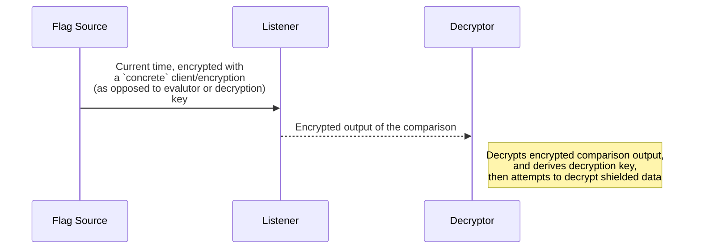

# Introduction
This repository contains a set of programs illustrating conditional, predicate-based, decryption - that is, decryption based on whether an input satisfies a certain set of constraints. These constraints should be able to be made as opaque and tamper-resistant as possible.

We emphasize an approach that breaks the process of conditionally decrypting data up across multiple systems, each oblivious to the connection between the user and the other two. [CryptDB](https://cacm.acm.org/research/cryptdb-processing-queries-on-an-encrypted-database/) and other SMPC systems provide precedent for this idea.

At present, we use Zama's `concrete` FHE library to accomplish this.

## System UML Diagram

## System Participants
The user wishes to have some data decrypted after a certain time, without their continued involvement. To facilitate this, a _user_ will launch three other systems/nodes:
+ A _time node_ which will provide authenticated time measurements to a...
+ _Comparison node_ which will compare present times $t_p$ with the _threshold time_ $t_t$ . This node will only operate on encryptions of this data using FHE - $e(t_p)$ and $e(t_t)$. Obfuscated results of these comparisons $e(o(c_{t,p}))$ are then sent to the ...
+ _Decryption node_, which will decrypt $e(o(c_{t,p}))$ and use it to derive a key that can decrypt the data. 

Each system communicates with the other in such a way that the destination of its output is unknown. This may be achieved by creating wallets on one or more block chains that only store the outputs of each node in the system. The destination can then monitor block chain activity and process transaction data related to only transactions associated with their input wallets.

### User
1) Creates a plaintext, $m$ , to be decrypted after a certain point in time and what, precisely, that time is. The time at which decryption is to occur is called the _threshold time_. The bit-chunks of the _threshold times_ as well as _present times_ provided by the timing node are denoted as $t_{t,i}$ and $t_{p,i}$, respectively.
2) Create encryption, decryption, and execution/re-linearization keys, denoted $e_c$, $d_c$, and $r_c$ where $c$ is used to denote their use for the _comparison_ circuit.
3) Create anti-tamper data provided to the time node used to ensure that encryptions of $t_p$ are less (or ideally not at all) malleable. 
4) Encrypts the plaintext with an encryption key derived from the output of the comparison circuit when a time greater than the threshold time is provided. 
5) Initialize the time measurment node - $e_c$ is sent to ensure that the time node output cannot be read, any anti-tamper data, as well as output dispatch directions. Its output is $a(e(t_p))$, where $a()$ is an anti-tamper function.
6) Initialize a new comparison node instance with instructions on how to receive encrypted time values as well as output directions. $e_r$ is sent to this node as well as the comparison circuit. _Encryption keys are not sent._ Its input is $a(e(t_p))$ and output is $e(o(c_{t,p}))$ where $o$ is an obfuscation function.
7) Initialize a new decryption node instance with the encrypted plaintext $e(m)$ as well as instructions on how to receive comparision values. _Encryption and execution/re-linearization keys are not sent_. Its input is $e(o(c_{t,p}))$ and output is $m$ if the comparison is true.

### Time Node
The time source emits present time readings, $t_p$. However, these readings should be encrypted so that others cannot discern their true nature. Anti-tamper data will also be included so that adversaries are able to see the time node's output are unable to manipulate them into a very large time, which would be able to trigger a decryption pre-maturely. One such adversary may be the runner of the comparison node. 

Time node is initialized with an FHE key $e_c$ and any other anti-tamper data that helps ensure that its output cannot be easily molded into a large time that will surely trigger a pre-mature decryption.

These anti-tamper augmented times can be said to be _authenticated_.

### Comparison Node
The comparision node compares the encrypted, authenticated times $a(e(t_p))$ with $e(t_t)$ and emit a comparison result $e(o(c_{t,p}))$ that:
a) When $t_p \geq t_t$ - an encrypted seed that, when decrypted, will provide enough information to a key derivation mechanism that generates a valid decryption key
b) When $t_p \le t_t$ - a nonsense encrypted value that cannot be used to derive the correct decryption key

The comparison node is provided with $e(t_t)$, an FHE encryption of the time threshold past which, time measurments will result in outputs that can trigger decryption of $e(m)$

Its input cryptographic material is only $e_r$, a noise reduction / FHE circuit execution key and is thus incapable of encrypting new inputs to the circuit or decrypting its output. _However, it can perform computations on any and all encrypted data provided to it, should a malicious operator choose. 

### Decryption Node
The decryption node is responsible for decrypting data when $t_p \geq t_t$. Should the user configure it further, this node could execute actions based on the decrypted data $m$ . 

This node is initialized with $d_c$, the FHE decryption key and neither the encryption key or execution key. This is to ensure that the 

# Comparison Circuit Schemes
The following schemes detail how to compare a threshold time, $t_t$ with the present time $t_p$. 

## Implementation Notes
a) 32 bit comparisons are not directly supported in Zama's `concrete` library, but 16-bit-and-lower comparisons are. 
b) The maximum size of an encrypted lookup table in `concrete` is `0xffff`
c) Bit-field operations appear unreliable in `concrete` at the time of writing

## A - No Anti-Tamper Schema
$t_t$ and $t_p$ are simply provided as $e(t_t)$ and $e(t_p)$. A comparison lookup table is implemented to compare the 32 bit number in two 16-byte chunks.

### Attack
$e(t_t)$ and $e(t_p)$ can be added and multiplied until a large enough time to trigger a decryption is conceived. 

## B - Byte-Concatenation Anti-Tamper
In this scheme, anti-tamper values (one for each chunk of the target time and one for each chunk of the present time) are pre-computed and appended to the target time and present times to defeat use of linear combinations of time inputs to forge large times.

Instead of a chunked comparison of two encrypted 16-byte numbers directly, the 16 byte chunks are broken up into two 7 bit numbers, each with one bit to handle overflow. The low 7 bits are used to hold _anti tamper bits_ which will prevent simple additions / multiplications of input times. 

The pre-encryption anti-tamper input bit sequence can be written as $a(t_{x_{i,i+7}}) = \{ o_t, t_{x_{i,i+7}} , o_a, a_{x_{i,i+7}} \}$, $o_t$ comprising the most significant bit, where $x \in \{ p, t \}$ . 

A lookup table of size `0xffff`can be generated to index the results of $a(t_{p_{i,i+7}}) - a(t_{t_{i,i+7}})$ . Those for which $o_t$ is equal to 1 are those where $t_{p_{i,i+7}} > t_{t_{i,i+7}}$. The difference in anti-tamper values comprise the low 8 bits, thus making a relevant index dependent on the anti-tamper values. 

One constraint on the anti-tamper values is that $a_{p_{i,i+7}} \ge a_{t_{i,i+7}}$ . Otherwise, overflow will occur and the value of $t_{p_{i,i+7}} - t_{t_{i,i+7}}$ will be off-by-minus-one. 

### Attack
Although this scheme may effectively prevent a malicious comparison node from using linear combinations of inputs to create large time value chunks, it does not help when adversaries are able to read multiple present time inputs. 

#### Anti-Tamper Erasure Method
$d_{t, t-1} = a(t_{p_{i,i+7}})_{t} - a(t_{p_{i,i+7}})_{t-1}$ will create a value where the anti-tamper bits are eliminated. $d_{t, t-1}$ can be added to $a(t_{x_{i,i+7}})$ repeatedly, incrementing the time chunk without influencing its anti-tamper bits.

#### Chunk Re-Ordering / Repetition Method
Times chunks may be swapped out or repeated. If an adversary is able to determine the largest-value'd chunk of the time, potentially by comparing the input time with its likely plaintext value based on environmental factors, they may repeat that over and over again.

### TODO: Attack Counter
Usage of nonces and bit-wise operations to ensure that chunk re-usage or isolated operations to a specific chunk affect the validity of the comparison may be helpful. Operating on encryptions or hashes of the numbers would break the linear properties of the number (subtraction, addition, etc would cease to work), but diffusion must be ensured across all chunks to ensure that repetition may not work.

# Future Goals
## Math-Assisted Anti-Tamper
In order to guide our exploration, we need to enumerate the properties we seek out of an anti-tamper system:
+ Denial of linear operations
+ Denial of repetition of sub-time units

Comparison tables may need to be adjusted per-chunk in a whole-number aware manner. Hashing and otherwise encryption of the chunks, particularly of a nonce diffused across the whole number, may help.

## Circuit Obfuscation
If the circuit can be obfuscated enough, the attacker may have less of an idea of which malleability attacks should be applied or prioritization of which comparison nodes to attack first. 

The first avenue of obfuscation will likely be the transformation of the entire circuit into a multi-tiered lookup table, without usage of the subtraction or comparison operators.

## Time History Denial
Moving the process of reading present times from the block chain to another system would make it harder for adversaries to get prior time readings.

[Double ratchet encryption](https://en.wikipedia.org/wiki/Double_Ratchet_Algorithm) and other perfect forward secrecy mechanisms would ensure that no prior time encryptions unseen by the adversary can be used to facilitate a malleability attack.

## Exploration of Inter-Node Communication Methods
At the time of writing, simply inspecting the output of wallets on various block chain platforms, such as Ethereum, Solana, and Monero may prove fruitful.

Encryption of the FHE ciphertext could be explored so that outside parties are unaware that FHE-encrypted data is being used in the first place and would also be rendered unable to download the comparison circuit and run it using said values.

## Exploration of Node-Deployment Methods
[P2P Cloud](https://p2pcloud.io/docs/blog/what-is-p2p-cloud/) may prove adept quick provisioning.

Otherwise, running nodes on [Constellation](https://github.com/edgelesssys/constellation) or other cloud services that allow confidential containers / VMs would provide added security.

# Artifacts
## Dockerfile
The included `Dockerfile` is a decent one to explore the most reliable FHE implementations.

